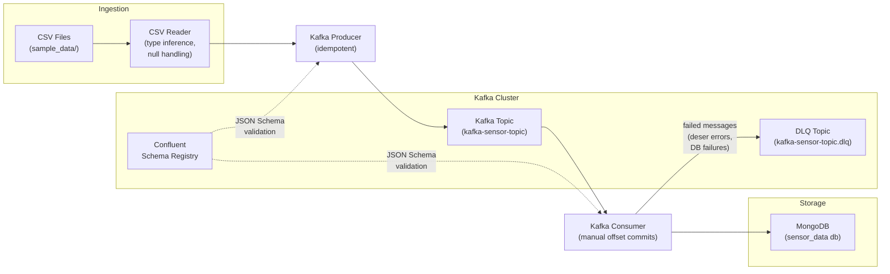

# Sensor Data Streaming Pipeline


A production-grade streaming data pipeline that ingests sensor CSV data, publishes it to Apache Kafka with JSON Schema validation via Confluent Schema Registry, and sinks it into MongoDB. Built with idempotent production, at-least-once consumer delivery, a Dead Letter Queue for poison messages, and retry with exponential backoff for transient failures.

---

## Table of Contents

- [Architecture](#architecture)
- [Features](#features)
- [Technology Stack](#technology-stack)
- [Quick Start with Docker](#quick-start-with-docker)
- [Local Development Setup](#local-development-setup)
- [Project Structure](#project-structure)
- [Configuration Reference](#configuration-reference)
- [How It Works](#how-it-works)
- [Delivery Guarantees](#delivery-guarantees)
- [Dead Letter Queue](#dead-letter-queue)
- [Testing](#testing)
- [Makefile Targets](#makefile-targets)
- [CI/CD](#cicd)

---

## Architecture



### Data Flow

1. **Ingestion** -- The CSV reader scans `sample_data/` subdirectories. Each subdirectory name becomes a Kafka topic. CSV rows are read in configurable chunks with pandas, and each value is coerced to its inferred native Python type (int, float, None, or string).

2. **Schema Generation** -- A JSON Schema (draft-07) is auto-generated from CSV column headers by sampling up to 1,000 rows. Numeric columns are typed as `number`, string columns as `string`, and columns with missing values get nullable types like `["number", "null"]`.

3. **Production** -- Each row is serialized as a JSON message using the Confluent `JSONSerializer` and published to Kafka with a UUID key. The producer runs with `enable.idempotence=True` and calls `poll()` between each produce to service delivery callbacks and prevent buffer overflow.

4. **Consumption** -- The consumer deserializes messages using the same JSON Schema, accumulates records in a batch, and inserts them into MongoDB when the batch reaches the configured size (default: 5,000). Offsets are committed only after a successful database write.

5. **Error Handling** -- Messages that fail deserialization are sent directly to the DLQ. If a MongoDB batch insert fails, it is retried 3 times with exponential backoff (1s, 2s, 4s). If all retries are exhausted, every record in the batch is individually routed to the DLQ, and offsets are committed to prevent reprocessing poison data.

---

## Features

### Data Pipeline
- Auto-generates JSON Schema (draft-07) from CSV headers with type inference
- Chunked CSV reading with configurable chunk size for memory efficiency
- Type coercion: numeric strings to int/float, `na`/`NaN`/empty to `None`
- Nullable field support in generated schemas (`["number", "null"]`)

### Kafka Integration
- Idempotent producer (`enable.idempotence=True`) eliminates duplicates from retries
- Manual offset commits after successful MongoDB writes (at-least-once delivery)
- Confluent Schema Registry validation on both producer and consumer sides
- Dead Letter Queue (`<topic>.dlq`) with structured error metadata

### Reliability
- Retry with exponential backoff for transient MongoDB failures (configurable retries, base delay, max delay)
- Graceful shutdown via SIGTERM/SIGINT signal handlers with in-flight batch flush
- Consumer commits offsets only after confirmed database writes
- Resources cleaned up in `finally` blocks (Kafka consumer, MongoDB client, DLQ producer)

### Operations
- Pydantic `BaseSettings` configuration with startup validation and `.env` file support
- Structured JSON logging to file + human-readable console output
- Docker Compose full-stack deployment (Zookeeper, Kafka, Schema Registry, MongoDB, app)
- GitHub Actions CI with ruff linting and pytest
- 71 unit tests with full mocking of external dependencies

---

## Technology Stack

| Component | Technology |
|---|---|
| Message Broker | Apache Kafka (Confluent Platform 7.6) |
| Schema Validation | Confluent Schema Registry (JSON Schema draft-07) |
| Database | MongoDB 7.0 |
| Language | Python 3.12 |
| Configuration | Pydantic Settings |
| Data Processing | pandas, numpy |
| Logging | python-json-logger |
| Testing | pytest, pytest-cov |
| Linting | ruff |
| Containerization | Docker, Docker Compose |
| CI/CD | GitHub Actions |

---

## Quick Start with Docker

The fastest way to see the pipeline running end-to-end. No external accounts needed -- everything runs locally.

```bash
# Clone the repository
git clone https://github.com/vigneshsabapathi/sensor-data-streaming-pipeline.git
cd sensor-data-streaming-pipeline

# Start the full stack (Zookeeper, Kafka, Schema Registry, MongoDB, Producer, Consumer)
docker compose up --build -d

# Watch the logs
docker compose logs -f producer consumer

# Verify data landed in MongoDB
docker compose exec mongodb mongosh --quiet \
  --eval "db.getSiblingDB('sensor_data').getCollection('kafka-sensor-topic').countDocuments()"

# Stop and clean up
docker compose down -v
```

The Docker Compose stack includes health checks on all infrastructure services. The producer and consumer containers wait for Kafka, Schema Registry, and MongoDB to be healthy before starting.

### Docker Services

| Service | Image | Port | Purpose |
|---|---|---|---|
| zookeeper | confluentinc/cp-zookeeper:7.6.0 | 2181 | Kafka coordination |
| kafka | confluentinc/cp-kafka:7.6.0 | 9092, 29092 | Message broker |
| schema-registry | confluentinc/cp-schema-registry:7.6.0 | 8081 | JSON Schema validation |
| mongodb | mongo:7.0 | 27017 | Data sink |
| producer | Custom (Python 3.12) | -- | CSV to Kafka |
| consumer | Custom (Python 3.12) | -- | Kafka to MongoDB |

---

## Local Development Setup

For development against your own Confluent Cloud and MongoDB Atlas instances.

```bash
# Create and activate virtual environment
python -m venv venv
source venv/bin/activate        # Windows: venv\Scripts\activate

# Configure credentials
cp .env.example .env
# Edit .env with your Confluent Kafka, Schema Registry, and MongoDB credentials

# Install dependencies (includes editable package install)
pip install -r requirements.txt

# Place CSV data files in sample_data/<topic_name>/
# Each subdirectory name becomes the Kafka topic name

# Run the producer
python producer_main.py

# Run the consumer (in a separate terminal)
python consumer_main.py
```

You can also run the infrastructure locally via Docker and the application natively:

```bash
# Start only infrastructure containers
make infra

# Set env vars for local infrastructure
export BOOTSTRAP_SERVER=localhost:9092
export SECURITY_PROTOCOL=PLAINTEXT
export ENDPOINT_SCHEMA_URL=http://localhost:8081
export MONGO_DB_URL=mongodb://localhost:27017
# API_KEY, API_SECRET_KEY, SCHEMA_REGISTRY_API_KEY, SCHEMA_REGISTRY_API_SECRET
# can be set to any value (e.g., "local") when using PLAINTEXT protocol

# Run producer and consumer natively
make producer
make consumer
```

---

## Project Structure

```
sensor-data-streaming-pipeline/
├── producer_main.py                  # Entry point: discover topics from sample_data/, produce to Kafka
├── consumer_main.py                  # Entry point: discover topics from sample_data/, consume to MongoDB
│
├── src/
│   ├── kafka_config/
│   │   └── __init__.py               # Pydantic BaseSettings (KafkaSettings, MongoSettings, ConsumerSettings)
│   │                                  # sasl_conf(), schema_config(), lazy singleton accessors
│   ├── kafka_producer/
│   │   ├── json_producer.py           # produce_data_from_file() -- idempotent producer with Schema Registry
│   │   └── dlq_producer.py            # DLQProducer -- routes failed messages to <topic>.dlq
│   │
│   ├── kafka_consumer/
│   │   └── json_consumer.py           # consume_topic() -- consumer with DLQ, retry, graceful shutdown
│   │                                   # GracefulShutdown -- SIGTERM/SIGINT handler
│   │                                   # _flush_and_commit() -- batch insert + offset commit
│   ├── entity/
│   │   ├── sensor_record.py           # SensorRecord -- dynamic data model, from_dict/to_dict, ser/deser callbacks
│   │   ├── csv_reader.py              # read_csv_records() -- chunked reader with type coercion and null handling
│   │   │                               # infer_column_types() -- sample-based numeric/string/nullable detection
│   │   └── schema_manager.py          # generate_json_schema() -- JSON Schema draft-07 from CSV with type inference
│   │
│   ├── database/
│   │   └── mongodb.py                 # MongodbOperation -- pymongo wrapper, context manager, TLS-aware
│   │
│   ├── utils/
│   │   └── retry.py                   # retry_with_backoff() -- decorator with configurable retries and delays
│   │
│   └── kafka_logger/
│       └── __init__.py                # setup_logging() -- structured JSON file + console logging
│
├── tests/                             # 71 unit tests
│   ├── conftest.py                    # Fixtures: sample_csv_path, small_csv (temp), mock_env_vars
│   ├── test_sensor_record.py          # SensorRecord creation, roundtrip, serialization callbacks
│   ├── test_csv_reader.py             # Type coercion, null handling, column inference, CSV reading
│   ├── test_schema_manager.py         # Schema generation, type inference, nullable fields
│   ├── test_config.py                 # Pydantic validation, defaults, sasl_conf(), schema_config()
│   └── test_mongodb.py               # Context manager, insert delegation, mocked pymongo
│
├── sample_data/
│   └── kafka-sensor-topic/
│       └── aps_failure_training_set1.csv   # APS sensor failure dataset (~36,000 rows, 171 columns)
│
├── docker-compose.yml                 # Full stack: Zookeeper, Kafka, Schema Registry, MongoDB, app
├── Dockerfile                         # Python 3.12-slim with librdkafka
├── Makefile                           # Shortcuts: up, down, logs, infra, test, lint, clean
├── .github/workflows/ci.yml           # GitHub Actions: ruff lint + pytest
├── .env.example                       # Template for all required environment variables
├── .ruff.toml                         # Linter config: E/F/W/I rules, Python 3.12
├── pytest.ini                         # Test config: testpaths, markers, verbosity
├── requirements.txt                   # Pinned dependencies with extras
└── setup.py                           # Package definition (kafka 0.0.3)
```

---

## Configuration Reference

All configuration is loaded from environment variables or a `.env` file via Pydantic `BaseSettings`. The application validates all required settings at startup and fails immediately with a clear error message if any are missing.

Settings are accessed through lazy singletons: `get_kafka_settings()`, `get_mongo_settings()`, `get_consumer_settings()`. They are instantiated on first call, allowing tests to set environment variables before initialization.

### Kafka Settings

| Variable | Required | Default | Description |
|---|---|---|---|
| `API_KEY` | Yes | -- | Confluent Kafka SASL username |
| `API_SECRET_KEY` | Yes | -- | Confluent Kafka SASL password |
| `BOOTSTRAP_SERVER` | Yes | -- | Kafka bootstrap server address |
| `SECURITY_PROTOCOL` | No | `SASL_SSL` | Protocol (`SASL_SSL` for Confluent Cloud, `PLAINTEXT` for local) |
| `SASL_MECHANISM` | No | `PLAIN` | SASL mechanism |
| `ENDPOINT_SCHEMA_URL` | Yes | -- | Confluent Schema Registry URL |
| `SCHEMA_REGISTRY_API_KEY` | Yes | -- | Schema Registry authentication key |
| `SCHEMA_REGISTRY_API_SECRET` | Yes | -- | Schema Registry authentication secret |

When `SECURITY_PROTOCOL` is set to `PLAINTEXT`, SASL credentials are omitted from the Kafka client configuration automatically.

### MongoDB Settings

| Variable | Required | Default | Description |
|---|---|---|---|
| `MONGO_DB_URL` | Yes | -- | MongoDB connection string |
| `MONGO_DB_NAME` | No | `ineuron` | Target database name |

TLS is enabled automatically for `mongodb+srv://` connection strings and disabled for plain `mongodb://` connections.

### Consumer Settings

| Variable | Required | Default | Description |
|---|---|---|---|
| `CONSUMER_GROUP_ID` | No | `sensor-pipeline-group` | Kafka consumer group identifier |
| `CONSUMER_BATCH_SIZE` | No | `5000` | Records accumulated before each MongoDB batch insert |
| `AUTO_OFFSET_RESET` | No | `earliest` | Starting offset for new consumer groups (`earliest` or `latest`) |

---

## How It Works

### Type Inference

The `infer_column_types()` function in `csv_reader.py` samples up to 1,000 rows from the CSV and determines each column's type:

- Columns where all non-null values parse as numbers are typed as `"number"`
- Columns with any non-numeric string values are typed as `"string"`
- Columns with at least one null/missing value get nullable types: `["number", "null"]` or `["string", "null"]`
- Columns that are entirely null default to `["string", "null"]`

Values are coerced at read time: `na`, `NaN`, `NA`, `null`, `NULL`, and empty strings become Python `None`. Numeric strings are converted to `int` or `float`. numpy types are converted to native Python types.

### Batch Processing

The consumer accumulates deserialized records in memory until the batch reaches `CONSUMER_BATCH_SIZE` (default: 5,000). At that point:

1. The batch is inserted into MongoDB via `insert_many()`
2. If the insert fails, it is retried up to 3 times with exponential backoff (1s, 2s, 4s delays)
3. If all retries fail, each record in the batch is sent to the DLQ individually
4. Kafka offsets are committed synchronously after either a successful insert or a DLQ routing

On shutdown (SIGTERM, SIGINT, or KeyboardInterrupt), any partial batch is flushed through the same process before the consumer closes.

### Graceful Shutdown

The `GracefulShutdown` class registers signal handlers for SIGTERM and SIGINT using a `threading.Event`. The consumer's main loop checks `should_stop` on each iteration. When a signal is received:

1. The loop exits cleanly
2. Any accumulated records are flushed to MongoDB
3. The DLQ producer is flushed
4. The Kafka consumer is closed (triggers rebalance)
5. The MongoDB connection is closed

---

## Delivery Guarantees

### Producer (Exactly-Once per Partition)

The producer runs with `enable.idempotence=True`. Kafka assigns a producer ID and sequence numbers to each message, ensuring that retries caused by transient network failures do not create duplicate messages within a single partition. Each message is keyed with a UUID v4.

### Consumer (At-Least-Once)

Auto-commit is disabled (`enable.auto.commit=False`). Offsets are committed synchronously only after a batch is successfully written to MongoDB. If the consumer crashes between a database write and the offset commit, those messages will be re-delivered on restart. MongoDB writes are not idempotent, so duplicates are possible on crash recovery.

### Trade-Off

This design prioritizes data completeness over deduplication. No sensor reading is lost, but some may appear twice after a crash. For workloads requiring exactly-once semantics end-to-end, the consumer would need idempotent writes (e.g., upserts keyed on the message UUID).

---

## Dead Letter Queue

Failed messages are routed to a topic named `<original_topic>.dlq` (e.g., `kafka-sensor-topic.dlq`). Each DLQ record is a JSON object containing:

| Field | Description |
|---|---|
| `original_topic` | The topic the message was consumed from |
| `original_key` | The original message key (UTF-8 decoded) |
| `original_value` | The original message payload (UTF-8 decoded) |
| `error_type` | Python exception class name (e.g., `SerializationError`, `PyMongoError`) |
| `error_message` | Full error description |
| `error_stage` | Where the failure occurred: `deserialization` or `db_insert` |
| `timestamp` | UTC ISO 8601 timestamp of when the failure was recorded |

Messages enter the DLQ in two scenarios:
1. **Deserialization failure** -- the raw message bytes cannot be deserialized against the JSON Schema. The message is sent to the DLQ immediately without retry.
2. **Database insert failure** -- a batch insert fails after exhausting all retry attempts. Each record in the failed batch is sent to the DLQ individually, and offsets are committed to prevent infinite reprocessing.

---

## Testing

The test suite contains 71 tests covering all modules except the Kafka integration layer (which requires a running broker).

```bash
# Run all tests
pytest

# Run with verbose output
pytest -v

# Run with coverage report
pytest --cov=src --cov-report=term-missing

# Run only fast unit tests (skip tests that read the full sample CSV)
pytest -m "not integration"

# Run only integration-marked tests
pytest -m integration
```

All tests use dependency injection and mocking. No external services (Kafka, MongoDB, Schema Registry) are required to run the test suite.

### Test Coverage

| Module | Tests | What is tested |
|---|---|---|
| `test_sensor_record.py` | 14 | Creation, to_dict roundtrip, from_dict callback, mixed types, None values |
| `test_csv_reader.py` | 16 | Type coercion (10 cases), CSV reading, null handling, column inference |
| `test_schema_manager.py` | 12 | Schema structure, type inference, nullable fields, no-inference fallback |
| `test_config.py` | 12 | Pydantic validation errors, defaults, sasl_conf(), schema_config() |
| `test_mongodb.py` | 8 | Context manager, close(), constructor args, insert delegation |

---

## Makefile Targets

| Target | Command | Description |
|---|---|---|
| `make up` | `docker compose up --build -d` | Build and start the full stack |
| `make down` | `docker compose down -v` | Stop all containers and remove volumes |
| `make logs` | `docker compose logs -f` | Stream logs from all services |
| `make infra` | `docker compose up -d zookeeper kafka schema-registry mongodb` | Start only infrastructure |
| `make producer` | `python producer_main.py` | Run producer locally |
| `make consumer` | `python consumer_main.py` | Run consumer locally |
| `make test` | `python -m pytest tests/ -v` | Run the full test suite |
| `make lint` | `ruff check .` | Run the ruff linter |
| `make clean` | Stops containers, removes caches and logs | Full cleanup |

---

## CI/CD

The GitHub Actions workflow (`.github/workflows/ci.yml`) runs on every push to `main` and on pull requests:

1. **Checkout** -- fetches the repository
2. **Python Setup** -- installs Python 3.12 with pip caching
3. **Dependencies** -- installs all packages from `requirements.txt`
4. **Lint** -- runs `ruff check .` (pycodestyle, pyflakes, isort rules)
5. **Test** -- runs `pytest` with JUnit XML output
6. **Artifacts** -- uploads test results for inspection on failure
