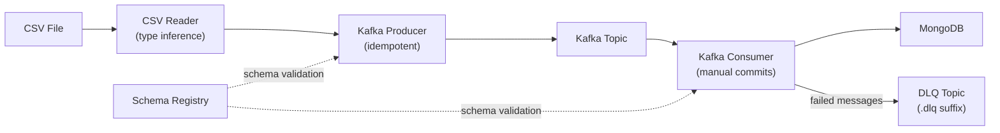

# Sensor Data Streaming Pipeline


A production-grade data pipeline that ingests CSV sensor data, serializes it through Confluent Kafka with JSON Schema validation, and sinks it into MongoDB. The pipeline auto-generates JSON Schema (draft-07) from CSV column headers with type inference, supports idempotent production, at-least-once delivery with manual offset commits, and routes failed messages to a Dead Letter Queue with full error metadata.

## Architecture



## Features

- **Pydantic config validation** -- all settings are validated at startup via `BaseSettings` with fail-fast semantics; missing or invalid env vars surface immediately
- **Type inference from CSV data** -- samples up to 1000 rows to distinguish `number`, `string`, and nullable columns; coerces numpy types to native Python
- **JSON Schema auto-generation** -- produces draft-07 schemas from CSV headers at runtime; registered with Confluent Schema Registry for producer/consumer validation
- **Idempotent producer** -- `enable.idempotence=True` eliminates duplicate messages from producer retries at the partition level
- **At-least-once delivery** -- `enable.auto.commit=False` with synchronous offset commits only after successful MongoDB batch inserts
- **Dead Letter Queue** -- failed messages (deserialization errors or DB insert failures) are routed to `<topic>.dlq` with error type, message, stage, and UTC timestamp metadata
- **Retry with exponential backoff** -- configurable decorator (`max_retries`, `base_delay`, `max_delay`) for transient MongoDB failures; delay doubles each attempt up to the cap
- **Graceful shutdown** -- `SIGTERM`/`SIGINT` handlers using `threading.Event`; in-flight batch is flushed to MongoDB and offsets committed before exit
- **Structured JSON logging** -- dual output: human-readable console + JSON-lines log files (`logs/`) via `python-json-logger`
- **71 unit tests** -- covering config validation, CSV reading, schema generation, sensor record serialization, and MongoDB operations

## Quick Start

```bash
# 1. Clone and set up environment
python -m venv venv
source venv/bin/activate        # Windows: venv\Scripts\activate

# 2. Configure credentials
cp .env.example .env
# Edit .env with your Confluent Kafka, Schema Registry, and MongoDB credentials

# 3. Install dependencies
pip install -r requirements.txt

# 4. Place CSV files in sample_data/<topic_name>/
#    Each subdirectory name becomes the Kafka topic name

# 5. Run the producer (publishes CSV rows to Kafka)
python producer_main.py

# 6. Run the consumer (reads from Kafka, writes to MongoDB)
python consumer_main.py
```

## Project Structure

```
.
├── producer_main.py              # Entry point: discover topics, produce CSV data
├── consumer_main.py              # Entry point: discover topics, consume to MongoDB
├── src/
│   ├── kafka_config/             # Pydantic settings (Kafka, MongoDB, consumer)
│   ├── kafka_producer/
│   │   ├── json_producer.py      # Idempotent producer with Schema Registry
│   │   └── dlq_producer.py       # Dead Letter Queue producer with error metadata
│   ├── kafka_consumer/
│   │   └── json_consumer.py      # Consumer with DLQ, retry, graceful shutdown
│   ├── entity/
│   │   ├── sensor_record.py      # Dynamic data model with ser/deser callbacks
│   │   ├── csv_reader.py         # Chunked CSV reading with type inference
│   │   └── schema_manager.py     # JSON Schema (draft-07) generation
│   ├── database/
│   │   └── mongodb.py            # pymongo wrapper with context manager support
│   ├── utils/
│   │   └── retry.py              # Exponential backoff decorator
│   └── kafka_logger/             # Structured JSON logging setup
├── tests/                        # 71 unit tests (pytest)
├── sample_data/                  # CSV files organized by topic subdirectory
├── .env.example                  # Template for all required environment variables
├── requirements.txt
├── pytest.ini
└── setup.py
```

## Configuration

All configuration is loaded from environment variables or a `.env` file via Pydantic `BaseSettings`. Settings are accessed through lazy singletons (`get_kafka_settings()`, `get_mongo_settings()`, `get_consumer_settings()`).

| Variable | Required | Default | Description |
|---|---|---|---|
| `API_KEY` | Yes | -- | Confluent Kafka API key |
| `API_SECRET_KEY` | Yes | -- | Confluent Kafka API secret |
| `BOOTSTRAP_SERVER` | Yes | -- | Kafka bootstrap server URL |
| `ENDPOINT_SCHEMA_URL` | Yes | -- | Schema Registry URL |
| `SCHEMA_REGISTRY_API_KEY` | Yes | -- | Schema Registry API key |
| `SCHEMA_REGISTRY_API_SECRET` | Yes | -- | Schema Registry API secret |
| `MONGO_DB_URL` | Yes | -- | MongoDB connection string |
| `MONGO_DB_NAME` | No | `ineuron` | MongoDB database name |
| `CONSUMER_GROUP_ID` | No | `sensor-pipeline-group` | Kafka consumer group ID |
| `CONSUMER_BATCH_SIZE` | No | `5000` | Records per MongoDB batch insert |
| `AUTO_OFFSET_RESET` | No | `earliest` | Where to start consuming (`earliest` / `latest`) |

## Testing

```bash
# Run all 71 tests
pytest

# With coverage report
pytest --cov=src --cov-report=term-missing

# Run only integration-marked tests
pytest -m integration
```

Tests use dependency injection -- the producer, consumer, MongoDB client, and DLQ producer all accept optional pre-configured instances, allowing full unit testing without live infrastructure.

## Delivery Guarantees

**Producer side:** The producer runs with `enable.idempotence=True`, which ensures that retries caused by transient network failures do not result in duplicate messages within a partition. Each message is keyed with a UUID.

**Consumer side:** Auto-commit is disabled. Offsets are committed synchronously only after a batch is successfully written to MongoDB. If the consumer crashes before committing, those messages will be re-delivered on restart -- this is standard **at-least-once** semantics. MongoDB writes are not inherently idempotent, so duplicates are possible on crash recovery.

**Dead Letter Queue:** Messages that fail deserialization or exhaust MongoDB retry attempts (3 retries with exponential backoff) are forwarded to a `<topic>.dlq` topic. Each DLQ record includes the original payload, error type, error message, failure stage, and a UTC timestamp. After sending a failed batch to the DLQ, offsets are still committed to prevent reprocessing the same poison messages indefinitely.
